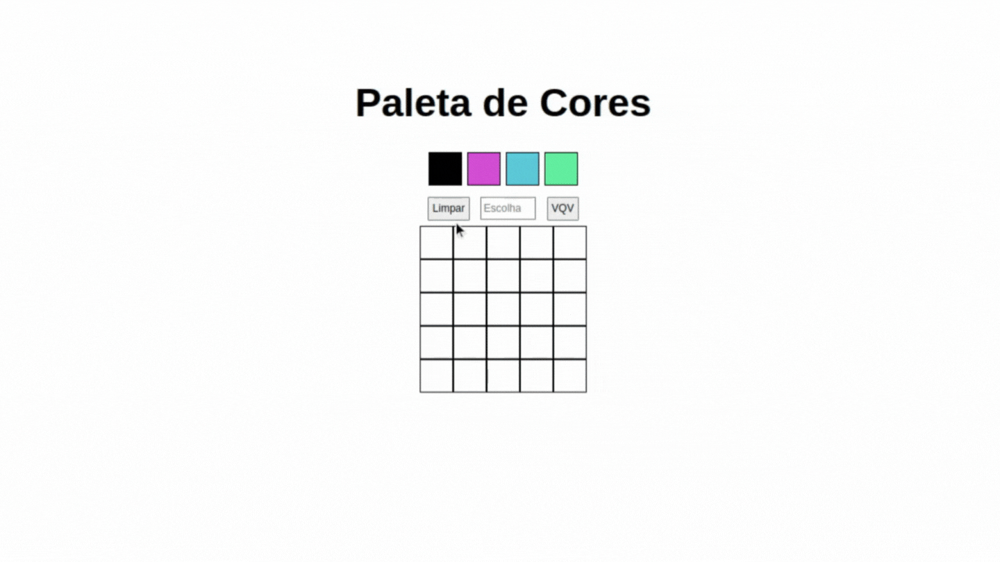

# Projeto Pixels Art

:rocket: *Desenvolvido em: 09/12/2021 - Bloco 05/Trybe*

## :dart: Objetivo

Desenvolver uma página web funcional para criar desenhos em pixels e disponibilizar uma paleta de cores que pode ser alterada ao recarregar a página

## :brain: Habilidades desenvolvidas

- Manipular o DOM
- Manipular elementos HTML com Javascript
- Utilizar seletores e eventos
- Organizar e estruturar o código

## :hammer_and_wrench: Ferramentas utilizadas

- HTML
- Javascript
- CSS

:zap: *Todos os projetos da Trybe utilizam ESlint e Stylelint*

## :mailbox: Contatos

